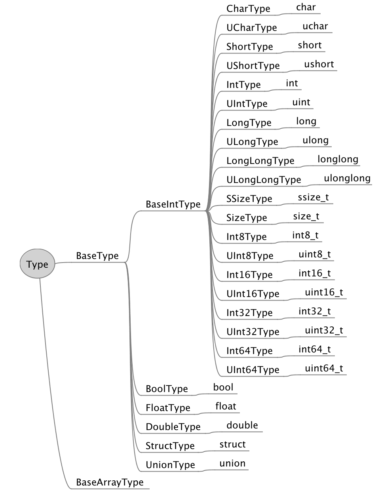

## Fundamental types

| struct api | c type             |
| ---------- | ------------------ |
| bool       | bool               |
| char       | signed char        |
| uchar      | unsigned char      |
| short      | short              |
| ushort     | unsigned short     |
| int        | int                |
| uint       | unsigned int       |
| long       | long               |
| ulong      | unsigned long      |
| longlong   | long long          |
| ulonglong  | unsigned long long |
| float      | float              |
| double     | double             |
| ssize_t    | ssize_t            |
| size_t     | size_t             |
| int8_t     | int8_t             |
| uint8_t    | uint8_t            |
| int16_t    | int16_t            |
| uint16_t   | uint16_t           |
| int32_t    | int32_t            |
| uint32_t   | uint32_t           |
| int64_t    | int64_t            |
| uint64_t   | uint64_t           |
| struct     | struct             |
| union      | union              |

## Inheritance diagram



## built-in methods

- get $buffer ()

  Return a node buffer

- get $arrayBuffer ()

  Return an ArrayBuffer

- get $address ()

  Return real address of current object

- get $value ()

  Get value

- set $value (value)

  Set value

## Static methods

- get byteSize ()

  Similar with sizeof()

- times (length)

  Return an instance of BaseArrayType

## Example

### int

```javascript
const struct = require('cstruct')

const a = new struct.int()

a.$value = 100

console.log(a) // <Buffer 64 00 00 00>
console.log(a.$value) // 100
```

### array

```javascript
const struct = require('cstruct')

const arr = new (struct.int.times(3))()

for (let i = 0; i < arr.length; i++) {
  arr[i].$value = i + 1
}

console.log(arr) // <Buffer 01 00 00 00 02 00 00 00 03 00 00 00>
console.log(arr[1].$value) // 2
```

### union

```javascript
const struct = require('cstruct')

class MyUnion extends struct.union {
  static get fields () {
    return [
      [ 'x', struct.char ],
      [ 'y', struct.int ]
    ]
  }
}

const a = new MyUnion()

a.$value = {
  'x': 266
}

console.log(a) // <Buffer 0a 00 00 00>
console.log(a.x.$value) // 10
console.log(a.y.$value) // 10

a.$value = {
  'y': 267
}

console.log(a) // <Buffer 0b 01 00 00>
console.log(a.x.$value) // 11
console.log(a.y.$value) // 267
```

### struct

```javascript
const struct = require('cstruct')

class Point extends struct.struct {
  static get fields () {
    return [
      [ 'x', struct.int ],
      [ 'y', struct.int ]
    ]
  }
}

const point = new Point({
  x: 1,
  y: 10
})

point.y.$value = 2

console.log(point) // <Buffer 01 00 00 00 02 00 00 00>
```

### complex struct

```javascript
const struct = require('cstruct')

class Point extends struct.struct {
  static get fields () {
    return [
      [ 'x', struct.int ],
      [ 'y', struct.int ]
    ]
  }
}

class MyStruct extends struct.struct {
  static get fields () {
    return [
      [ 'a', struct.char ],
      [ 's', Point ],
      [ 'b', struct.char.times(3) ]
    ]
  }
}

const s = new MyStruct()

s.a.$value = 1
s.s.x.$value = 2
s.s.y.$value = 3
s.b[0].$value = 4
s.b[1].$value = 5
s.b[2].$value = 6

console.log(s) // <Buffer 01 00 00 00 02 00 00 00 03 00 00 00 04 05 06 00>
```

